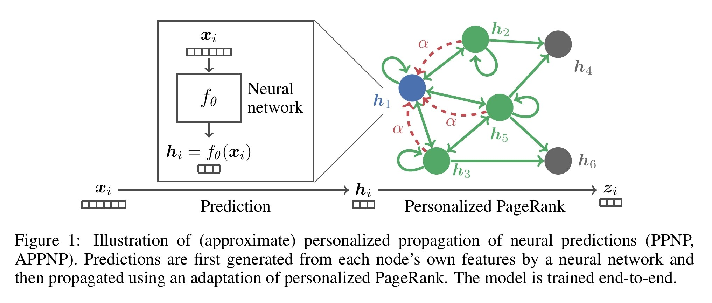
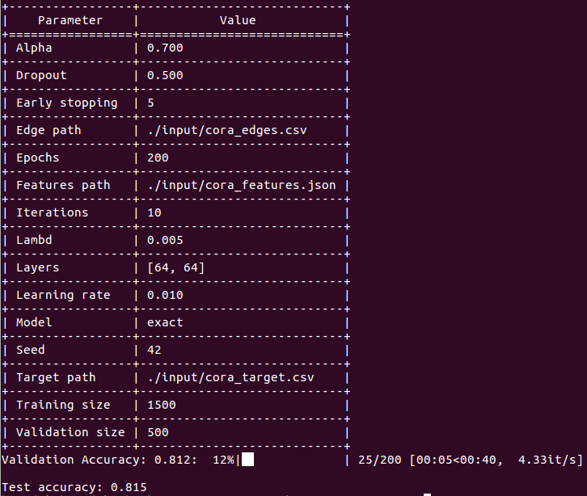

APPNP
==================================

[](https://arxiv.org/abs/1810.05997) [](https://codebeat.co/projects/github-com-benedekrozemberczki-appnp-master) [](https://github.com/benedekrozemberczki/APPNP/archive/master.zip)⠀[](https://twitter.com/intent/follow?screen_name=benrozemberczki)
 
A **PyTorch** implementation of **Predict then Propagate: Graph Neural
Networks meet Personalized PageRank (ICLR 2019).**
<p align="center">
  
</p>


---------------------------------

### Abstract

<p align="justify">
Neural message passing algorithms for semi-supervised classification on graphs have recently achieved great success. However, these methods only consider nodes that are a few propagation steps away and the size of this utilized neighborhood cannot be easily extended. In this paper, we use the relationship between graph convolutional networks (GCN) and PageRank to derive an improved propagation scheme based on personalized PageRank. We utilize this propagation procedure to construct personalized propagation of neural predictions (PPNP) and its approximation, APPNP. Our model's training time is on par or faster and its number of parameters on par or lower than previous models. It leverages a large, adjustable neighborhood for classification and can be combined with any neural network. We show that this model outperforms several recently proposed methods for semi-supervised classification on multiple graphs in the most thorough study done so far for GCN-like models.</p>

A PyTorch and Tensorflow implementation is awailable [[here.]](https://github.com/klicperajo/ppnp).

This repository provides a PyTorch implementation of PPNP and APPNP as described in the paper:

> Predict then Propagate: Graph Neural Networks meet Personalized PageRank.
> Johannes Klicpera, Aleksandar Bojchevski, Stephan Günnemann.
> ICLR, 2019.
> [[Paper]](https://arxiv.org/abs/1810.05997)

### Requirements
The codebase is implemented in Python 3.5.2. package versions used for development are just below.
```
networkx          2.4
tqdm              4.28.1
numpy             1.15.4
pandas            0.23.4
texttable         1.5.0
scipy             1.1.0
argparse          1.1.0
torch             1.1.0
torch-scatter     1.4.0
torch-sparse      0.4.3
torch-cluster     1.4.5
torch-geometric   1.3.2
torchvision       0.3.0
```
### Datasets
<p align="justify">
The code takes the **edge list** of the graph in a csv file. Every row indicates an edge between two nodes separated by a comma. The first row is a header. Nodes should be indexed starting with 0. A sample graph for `Cora` is included in the  `input/` directory. In addition to the edgelist there is a JSON file with the sparse features and a csv with the target variable.</p>
<p align="justify">
The **feature matrix** is a sparse binary one it is stored as a json. Nodes are keys of the json and feature indices are the values. For each node feature column ids are stored as elements of a list. The feature matrix is structured as:</p>

```javascript
{ 0: [0, 1, 38, 1968, 2000, 52727],
  1: [10000, 20, 3],
  2: [],
  ...
  n: [2018, 10000]}
```

The **target vector** is a csv with two columns and headers, the first contains the node identifiers the second the targets. This csv is sorted by node identifiers and the target column contains the class meberships indexed from zero. 

| **NODE ID**| **Target** |
| --- | --- |
| 0 | 3 |
| 1 | 1 |
| 2 | 0 |
| 3 | 1 |
| ... | ... |
| n | 3 |

### Options
Training an APPNP/PPNP model is handled by the `src/main.py` script which provides the following command line arguments.

#### Input and output options
```
  --edge-path       STR    Edge list csv.         Default is `input/cora_edges.csv`.
  --features-path   STR    Features json.         Default is `input/cora_features.json`.
  --target-path     STR    Target classes csv.    Default is `input/cora_target.csv`.
```
#### Model options
```
  --seed              INT     Random seed.                   Defailt is 42.
  --model             STR     Model exact or approximate.    Default is `exact`.
  --iterations        INT     APP iterations.                Default is 10.
  --alpha             FLOAT   Teleport parameter.            Default is 0.1
  --epochs            INT     Number of training epochs.     Default is 2000.
  --early-stopping    INT     Early stopping rounds.         Default is 5.
  --training-size     INT     Training set size.             Default is 1500.
  --test-size         INT     Test set size.                 Default is 500.
  --learning-rate     FLOAT   Adam learning rate.            Default is 0.01
  --dropout           FLOAT   Dropout rate value.            Default is 0.5
  --lambd             FLOAT   Rgularization parameter.       Default is 0.005.
  --layers            LST     Layer sizes in first layers.   Default is [64, 64]. 
```
### Examples
The following commands learn a neural network and score on the test set. Training a model on the default dataset.
```
python src/main.py
```
<p align="center">

</p>

Training a PPNP model for a 100 epochs.
```
python src/main.py --epochs 100
```
Training an APPNP model.
```
python src/main.py --model approximate
```
Increasing the learning rate and the dropout.
```
python src/main.py --learning-rate 0.1 --dropout 0.9
```

--------------------------------------------------------------------------------

**License**

- [GNU License](https://github.com/benedekrozemberczki/APPNP/blob/master/LICENSE)

--------------------------------------------------------------------------------
